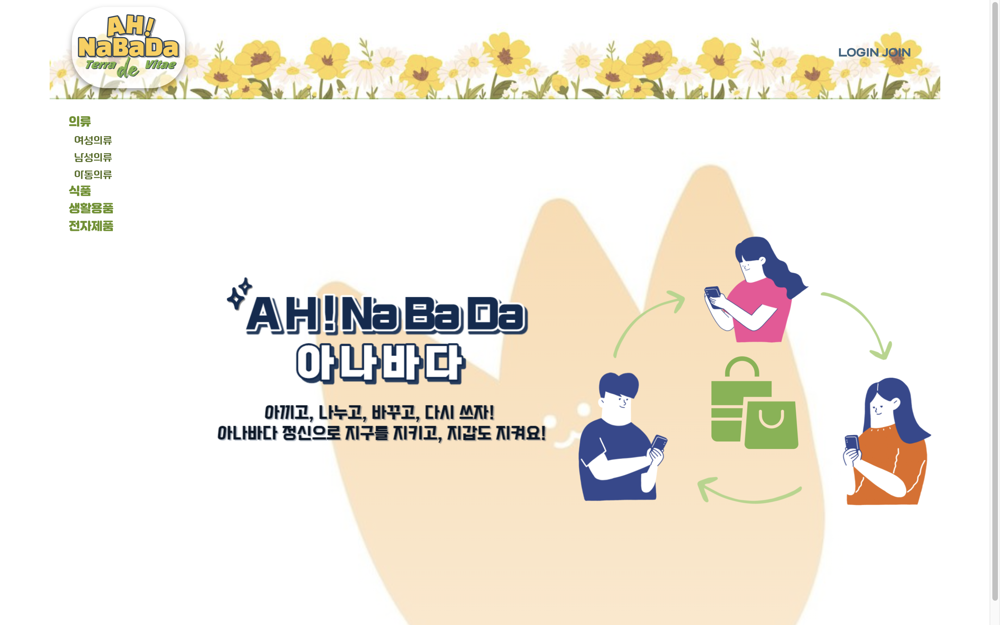
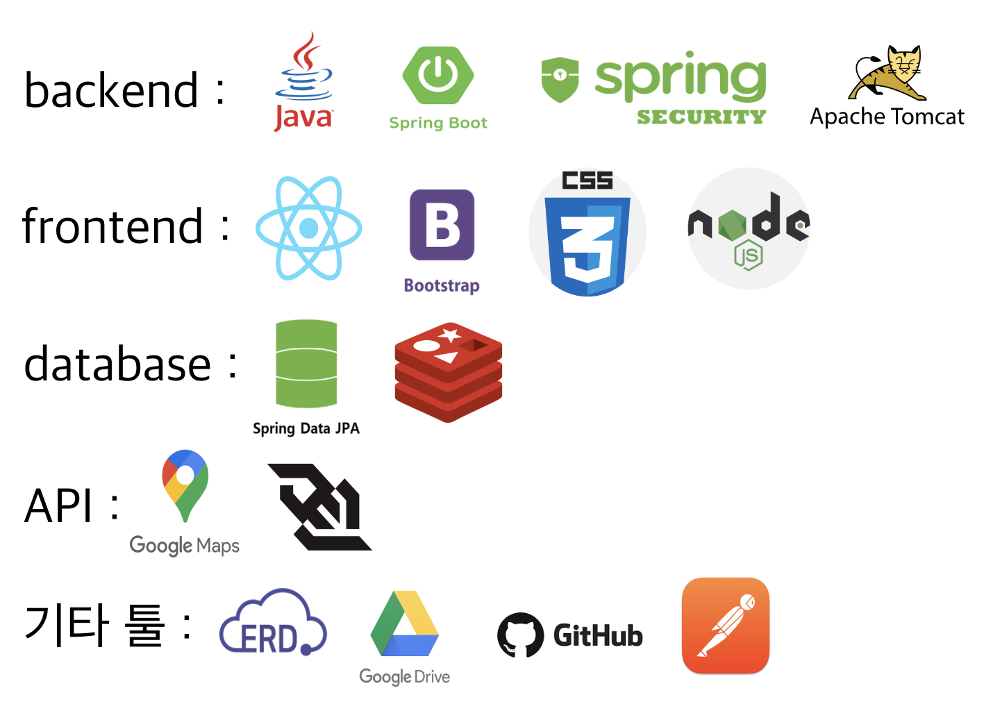

# ♻️ **ANBD 소개**

### ‘아’껴쓰고 ‘나’눠쓰고 ‘바’꿔쓰고 ‘다’시쓰자

#### 추억의 아나바다 운동!

이 프로젝트의 목표는 사용하지 않는 물건이 다른 사람에게는 필요할 수 있음을 사용자가 인식하고,
물건의 가치를 재발견하며 새로운 소비 패턴을 형성하는 것입니다.  

더 나아가 추억의 아나바다 운동을 MZ세대에 알리고 사용자들에게 물건을 재활용하고 다시 활용함으로써 환경 보호에 기여한다는 성취감까지 제공하고자 합니다.

## 😀 **팀원 소개**

| 팀원  | 링크 | 역할                         |
|-----|--|----------------------------|
| 김효은 | 깃허브 | 프론트엔드 총괄                   |
|     |  | 반응형 웹 UI 구현                |
|     |  | 홈페이지 전체 디자인 구현             |
| 이종현 | 깃허브 | 웹소켓을 이용한 채팅방 구현            |
|     |  | 마이페이지, 관리자페이지 구현           |
| 장고운 | 깃허브 | JWT 로그인 구현                 |
|  |  | Redis를 이용한 로그아웃, 이메일 인증 구현 |
| 권희수 | 깃허브 | 상품 CRUD 구현                 |
|  |  | 구글맵API를 이용한 만남장소 구현         |

## 🛠 **기술 스텍**

## 📆 **개발 기간**

**2024.02.07 ~ 2024.03.20 (총 6주)**

| 주차  |   구분    | 활동                 |
|:---:|:-------:|:-------------------|
| 1주차 |  사전기획   | 프로젝트 주제 선정 및 기획안 작성 | 
| 2주차 | 데이터 전처리  |    데이터 정제 및 정규화 |
| 3주차  |   모델링   | 기본  UI 설계          |  
| 4주차| 서비스 구축  | 웹 서비스 시스템 설계       | 
| 5주차 | 서비스 구축  | 웹 서비스 시스템 설계       | 
| 6주차 | 서비스 구축  | 최적화, 오류수정          |  

## 🔄 **시스템 설계**

1. 클라이언트 요청: 사용자가 리액트 기반의 웹 애플리케이션에서 어떤 동작(예: 데이터 조회, 데이터 입력)을 요청하면, 리액트 앱은 해당 요청에 해당하는 HTTP 요청을 서버의 API 엔드포인트로 보냅니다.  

2. 서버 처리: 자바 스프링 부트 서버가 클라이언트로부터의 API 요청을 받으면, 스프링 데이터 JPA를 통해 데이터베이스에 접근하여 요청된 작업(데이터 조회, 수정, 삭제 등)을 수행합니다.  
처리 결과를 받아서 서버는 그 결과를 다시 클라이언트에 JSON 형태로 응답합니다.

3. 클라이언트 응답 처리: 리액트 앱은 서버로부터의 응답 데이터를 받아 사용자 인터페이스에 반영합니다. 이를 통해 사용자는 최신 데이터를 볼 수 있게 됩니다.

## **서비스 기능 소개**

### JWT 로그인

### 상품 등록 CRUD

### 채팅방

### 마이페이지

### 관리자페이지

### 반응형 웹

